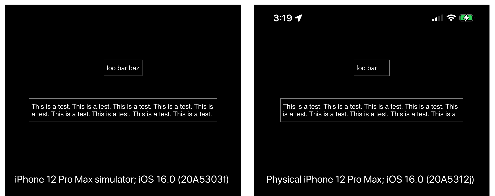

#  UITextView intrinsic size bug

This bug was fixed in iOS 16.0 beta 4.

- - -

In iOS 16 Beta 3 on my iPhone 12 Pro Max, the intrinsic size of a `UITextView` is not being calculated correctly. See how the following code renders on iPhone 12 Pro Max simulator running iOS 16.0 (20A5303f) and on a physical iPhone 12 Pro Max running iOS 16.0 Beta 3 (20A5312j):

